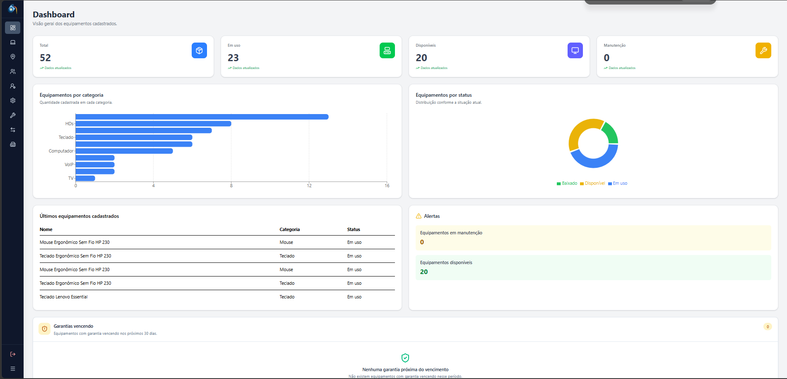
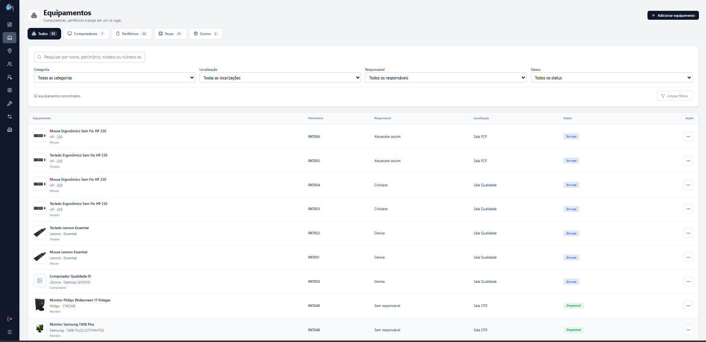
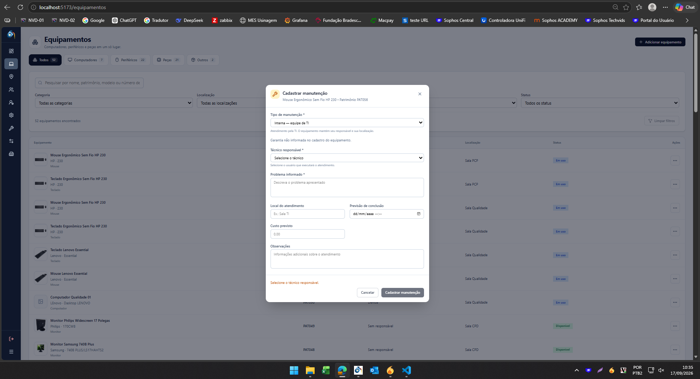

# ConnectionJS

Sistema web para **gerenciamento de ativos e equipamentos de TI**, desenvolvido para centralizar informações sobre equipamentos, responsáveis, localizações, hardware, movimentações e manutenções.

O projeto também possui integração com **Zabbix**, permitindo relacionar computadores cadastrados no sistema aos hosts monitorados e apresentar informações de rede e disponibilidade.

## Principais funcionalidades

* Cadastro e gerenciamento de equipamentos de TI
* Organização dos equipamentos por categorias
* Controle de colaboradores e responsáveis
* Gerenciamento de localizações
* Registro das características de hardware
* Histórico de movimentações dos equipamentos
* Entrega, troca e devolução de equipamentos
* Mudança de localização e responsável
* Controle de manutenções
* Registro de diagnóstico, solução, custos e datas
* Histórico completo dos equipamentos
* Integração com Zabbix
* Consulta dos endereços IP dos computadores
* Consulta do status dos hosts monitorados
* Dashboard para acompanhamento do ambiente

## Tecnologias utilizadas

### Frontend

* React
* TypeScript
* Vite
* Tailwind CSS
* React Router
* Axios
* Recharts
* Lucide React
* Sonner

### Backend

* Node.js
* Express
* TypeScript
* Prisma ORM
* SQLite
* JWT
* Zod
* Axios
* bcryptjs
* Multer

### Monitoramento

* Zabbix
* API JSON-RPC do Zabbix

## Arquitetura

O backend utiliza uma arquitetura em camadas para separar as responsabilidades da aplicação:

```text
Controller
    ↓
Service
    ↓
Repository
    ↓
Prisma ORM
    ↓
SQLite
```

Essa organização facilita a manutenção, evolução e organização do sistema.

## Estrutura do projeto

```text
connectios/
├── backend/
│   ├── prisma/
│   ├── src/
│   │   ├── config/
│   │   ├── controllers/
│   │   ├── repositories/
│   │   ├── routes/
│   │   ├── services/
│   │   ├── validators/
│   │   ├── middlewares/
│   │   └── errors/
│   ├── package.json
│   └── tsconfig.json
│
├── frontend/
│   ├── src/
│   ├── package.json
│   └── vite.config.ts
│
└── README.md
```

## Como executar

### Pré-requisitos

Tenha instalado:

* Node.js
* npm
* Git

### 1. Clonar o projeto

```bash
git clone https://github.com/Moises-hansich/connectios.git
cd connectios
```

### 2. Executar o backend

```bash
cd backend
npm install
npm run dev
```

Configure previamente as variáveis de ambiente necessárias para sua instalação.

### 3. Executar o frontend

Abra outro terminal:

```bash
cd frontend
npm install
npm run dev
```

O Vite mostrará no terminal o endereço local da aplicação.

## Módulos

### Equipamentos

Centraliza os ativos de TI e informações como categoria, fabricante, modelo, número de série, patrimônio, status, localização e responsável.

### Hardware

Permite registrar e organizar as características de hardware associadas aos equipamentos.

### Colaboradores

Gerencia os colaboradores responsáveis pelos equipamentos cadastrados.

### Localizações

Organiza os equipamentos de acordo com sua localização física dentro da organização.

### Movimentações

Mantém o histórico das alterações realizadas nos equipamentos, incluindo:

* Entrega
* Troca
* Devolução
* Mudança de localização
* Mudança de responsável
* Entrada em manutenção
* Retorno de manutenção
* Baixa de equipamento

As movimentações são registradas com data e hora para manter a rastreabilidade do ativo.

### Manutenções

Permite acompanhar as manutenções realizadas nos equipamentos, incluindo informações como:

* Problema informado
* Diagnóstico
* Solução
* Local da manutenção
* Empresa ou responsável pelo atendimento
* Data de saída
* Previsão de retorno
* Data de retorno
* Custo
* Status
* Observações

O sistema também registra automaticamente as movimentações relacionadas à entrada e ao retorno de manutenção.

## Integração com Zabbix

O ConnectionJS utiliza a API do **Zabbix** para relacionar equipamentos cadastrados no sistema aos hosts monitorados.

A integração permite complementar o inventário com informações do ambiente de monitoramento, como:

* Host correspondente ao equipamento
* Endereços IPv4
* Interfaces de rede
* Status de disponibilidade
* Associação entre computador, colaborador e localização

Dessa forma, o ConnectionJS combina **inventário de ativos** com informações de **monitoramento de infraestrutura**.

## Screenshots

Screenshots da aplicação serão adicionados nesta seção.

### Dashboard



### Equipamentos



### Manutenções



### Integração com Zabbix

`Em breve`


## Status do projeto

**Em desenvolvimento**

O ConnectionJS continua recebendo melhorias em:

* Funcionalidades
* Interface
* Regras de negócio
* Controle de manutenção
* Histórico de equipamentos
* Integração com Zabbix
* Monitoramento de ativos

## Objetivo do projeto

O ConnectionJS foi desenvolvido com o objetivo de aplicar conhecimentos de **desenvolvimento web, banco de dados, suporte técnico, infraestrutura e monitoramento** em uma solução real para gerenciamento de ativos de TI.

## Autor

**Moisés Pierre Hanisch**

Técnico em Informática e desenvolvedor do ConnectionJS.

GitHub: [@Moises-hansich](https://github.com/Moises-hansich)
